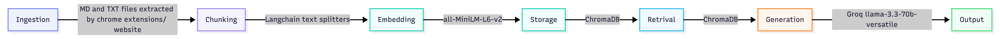

# Project 1 Planning: The Unofficial Guide

> Write this document before you write any pipeline code.
> Your spec and architecture diagram are what you'll use to direct AI tools (Claude, Copilot, etc.) to generate your implementation — the more specific they are, the more useful the generated cIode will be.
> Update the Retrieval Approach and Chunking Strategy sections if you change your approach during implementation.
> Update this file before starting any stretch features.

---

## Domain

<!-- What domain did you choose? Why is this knowledge valuable and hard to find through official channels? -->
Domain: Resources and Communities for UMD Alumni's 

Why: I graduated around a year ago and was search for a network and resources to help with my job search. Post graduation graduates want to connect with alumni's and gain resources from the university they graduated from. The transition from student to working full time comes with challenges and with a network support can be had. Finding this information is hard as it on multiple different platforms so having a guidebook would be a good resource. 

---

## Documents

<!-- List your specific sources: URLs, subreddit names, forum threads, or file descriptions.
     Aim for at least 10 sources that together cover different subtopics or perspectives within your domain. -->

| # | Source | Description | URL or location |
|---|--------|-------------|-----------------|
| 1 | Reddit | Alumni, your terpmail may be deleted if you don't take action | https://www.reddit.com/r/UMD/comments/1dpc8wj/alumni_your_terpmail_may_be_deleted_if_you_dont/ |
| 2 | Reddit| UMD Alumni Association: What's In It For Me? An event explaining the benefits of being an alum May 16th | https://www.reddit.com/r/UMD/comments/1cr6efr/umd_alumni_association_whats_in_it_for_me_an/ |
| 3 | Reddit | I hate UMD. Stop sending me alumni mail. | https://www.reddit.com/r/UMD/comments/1ff0uor/i_hate_umd_stop_sending_me_alumni_mail/ |
| 4 | Reddit | What libraries and spaces are available for me, an alumni | https://www.reddit.com/r/UMD/comments/1i3oo33/what_libraries_and_spaces_are_available_for_me_an/ |
| 5 | Reddit | How weird would it be as an alumni to just hang around campus to do random stuff | https://www.reddit.com/r/UMD/comments/1kf0siy/how_weird_would_it_be_as_an_alumni_to_just_hang/ |
| 6 | Linkedin | University of Maryland Alumni Association Linkedin | https://www.linkedin.com/company/maryland-alumni |
| 7 | UMD Alumni Association | UMD Alumni Career Coaches| https://alumni.umd.edu/resources/coaches-corner |
| 8 | UMD Alumni Association | UMD Corporate Connections | https://alumni.umd.edu/resources/corporate-engagement |
| 9 | UMD Alumni Association | Membership Benefits | https://alumni.umd.edu/membership/benefits |
| 10 | UMD Alumni Association |  Connection and network | https://alumni.umd.edu/resources/terrapins-connect |

---

## Chunking Strategy

<!-- How will you split documents into chunks?
     State your chunk size (in tokens or characters), overlap size, and explain why those
     numbers fit the structure of your documents.
     A review-heavy corpus warrants different chunking than a long FAQ. -->

I will be using structural based chucking for my documents as they come from webpages and formatted with elements and content on the pages to break up display of information 
I have two different styles of documents, reddit posts and webpages with content. So each style with have a different requirements. 
+ Reddit: 
  + Chunk Size: will be split by comments with a char cap of 500 (sub-split long comments on sentence boundaries)
  + Overlap Size: I would like to get little overlap < 5%
  + Reasoning: Reddit threads have three main points of blocks, title, post details, thread replies. Post replies are shorter and conversation style so 200 char cap will be able to capture it. I want a small overlap percentage due to the replies being from independent places of the conversation and there might not always be an direct overlap relation due to topic change.
  + Update: bumped cap from 200 → 500 after seeing real comments run 400–900 chars; 200 was fragmenting them mid-sentence.

**Parsing notes:** authors export as `[unknown]`, so chunks are keyed by `thread_id + comment_index`. The "Alumni who lurk" thread is ~90 one-line replies, which inflates chunk count with low-info near-duplicates (see Anticipated Challenges, top-k 

tuning).
+ Webpages: 
  + Chunk Size: will be split by topic/header with a char chap of 500
  + Overlap: I would like to get overlap > 12 %
  + Reasoning: The webpages are mostly text based and used to display information to inform about the content presented. The content will be structured by labels or sections and typical these sections would be paragraph based so 500 char cap will be able to fit multiple sentences.

**Chunk size:**

**Overlap:**

**Reasoning:**

---

## Retrieval Approach

<!-- Which embedding model are you using (e.g., all-MiniLM-L6-v2 via sentence-transformers)?
     How many chunks will you retrieve per query (top-k)?
     If you were deploying this for real users and cost wasn't a constraint, what tradeoffs
     would you weigh in choosing a different embedding model — context length, multilingual
     support, accuracy on domain-specific text, latency? -->

**Embedding model:**
I will be using the recommend embedding model as it runs locally and widely used and has good reviews. 

**Top-k:**
I want to have a smaller k less than 10 due to the need of answers more relevant to the topic but with some variance so its isn't generic so around 4-5.

**Production tradeoff reflection:**
If I was building this for larger base with no cost issues I would need to able to target post grads from different universities and majors and backgrounds. The information will be mostly text based but with the addition of more diverse language, variation of resources and platforms, increased usage and retrieval. I would use a proprietary api for less overhead and google gemini fits the task.

---

## Evaluation Plan

<!-- List your 5 test questions with their expected correct answers.
     Questions should be specific enough that you can judge whether the system's response
     is right or wrong. "What are good dining halls?" is too vague.
     "What do students say about wait times at [dining hall name] during lunch?" is testable. -->

| # | Question | Expected answer |
|---|----------|-----------------|
| 1 | What resources can alumni use on campus | public spaces  |
| 2 | Is there alumni's I connect with for coaching for my career goals | Yes, there is career coaches|
| 3 | Is there a networking website for alumni's | Yes, Terrpians Connect|
| 4 | what type of membership length periods are available  | 1 year, 3 years, lifetime |
| 5 | Can I use the library late night after graduation| no, only during public hours |

---

## Anticipated Challenges

<!-- What could go wrong? Name at least two specific risks with reasoning.
     Consider: noisy or inconsistent documents, missing source attribution, off-topic
     retrieval, chunks that split key information across boundaries. -->

1. Issues with basic and generic answers with a smaller top k

2. Sources have formatting that is hard to parse.

---

## Architecture

<!-- Draw a diagram of your pipeline showing the five stages:
     Document Ingestion → Chunking → Embedding + Vector Store → Retrieval → Generation
     Label each stage with the tool or library you're using.
     You can use ASCII art, a Mermaid diagram, or embed a sketch as an image.
     You'll use this diagram as context when prompting AI tools to implement each stage. -->

---

## AI Tool Plan
+ I used claude to help direct me tools to use in this project
+ I used claude to better understand the terminology 
<!-- For each part of the pipeline below, describe:
     - Which AI tool you plan to use (Claude, Copilot, ChatGPT, etc.)
     - What you'll give it as input (which sections of this planning.md, which requirements)
     - What you expect it to produce
     - How you'll verify the output matches your spec

     "I'll use AI to help me code" is not a plan.
     "I'll give Claude my Chunking Strategy section and ask it to implement chunk_text()
     with my specified chunk size and overlap" is a plan. -->

**Milestone 3 — Ingestion and chunking:**

**Milestone 4 — Embedding and retrieval:**

**Milestone 5 — Generation and interface:**
